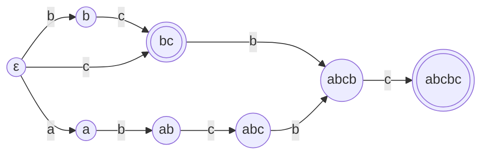

# general-sam

[](https://crates.io/crates/general-sam)
[](https://docs.rs/general-sam)
[](#license)
[](https://github.com/ModelTC/general-sam/actions)

A general suffix automaton implementation in Rust.

Python bindings and some utilities are also available.
Please check out [`general-sam-py`](https://github.com/ModelTC/general-sam-py).



> The suffix automaton of abcbc.

## Examples

```rust
use general_sam::{GeneralSam, BTreeTransTable};

let sam = GeneralSam::<BTreeTransTable<_>>::from_bytes("abcbc");

// "cbc" is a suffix of "abcbc"
assert!(sam.get_root_state().feed_bytes("cbc").is_accepting());

// "bcb" is not a suffix of "abcbc"
assert!(!sam.get_root_state().feed_bytes("bcb").is_accepting());
```

```rust
use general_sam::{GeneralSam, BTreeTransTable};

let sam = GeneralSam::<BTreeTransTable<_>>::from_chars("abcbc");

let mut state = sam.get_root_state();

// "b" is not a suffix but at least a substring of "abcbc"
state.feed_chars("b");
assert!(!state.is_accepting());

// "bc" is a suffix of "abcbc"
state.feed_chars("c");
assert!(state.is_accepting());

// "bcbc" is a suffix of "abcbc"
state.feed_chars("bc");
assert!(state.is_accepting());

// "bcbcbc" is not a substring, much less a suffix of "abcbc"
state.feed_chars("bc");
assert!(!state.is_accepting() && state.is_nil());
```

```rust
# #[cfg(feature = "trie")] {
use general_sam::{GeneralSam, Trie, BTreeTransTable};

let mut trie = Trie::<BTreeTransTable<_>>::default();
trie.insert("hello".chars());
trie.insert("Chielo".chars());

let sam = GeneralSam::<BTreeTransTable<_>>::from_trie(trie.get_root_state());

assert!(sam.get_root_state().feed_chars("lo").is_accepting());
assert!(sam.get_root_state().feed_chars("ello").is_accepting());
assert!(sam.get_root_state().feed_chars("elo").is_accepting());

assert!(!sam.get_root_state().feed_chars("el").is_accepting());
assert!(!sam.get_root_state().feed_chars("el").is_nil());

assert!(!sam.get_root_state().feed_chars("bye").is_accepting());
assert!(sam.get_root_state().feed_chars("bye").is_nil());
# }
```

## References

- [Mehryar Mohri, Pedro Moreno, Eugene Weinstein.
  General suffix automaton construction algorithm and space bounds.][paper]
- 刘研绎《后缀自动机在字典树上的拓展》
- [广义后缀自动机 - OI Wiki][general-sam-oi-wiki]

[paper]: https://doi.org/10.1016/j.tcs.2009.03.034
[general-sam-oi-wiki]: https://oi-wiki.org/string/general-sam/

## License

- &copy; 2023 Chielo Newctle \<[ChieloNewctle@gmail.com](mailto:ChieloNewctle@gmail.com)\>
- &copy; 2023 ModelTC Team

This project is licensed under either of

- [Apache License, Version 2.0](https://www.apache.org/licenses/LICENSE-2.0) ([`LICENSE-APACHE`](LICENSE-APACHE))
- [MIT license](https://opensource.org/licenses/MIT) ([`LICENSE-MIT`](LICENSE-MIT))

at your option.

The [SPDX](https://spdx.dev) license identifier for this project is `MIT OR Apache-2.0`.
